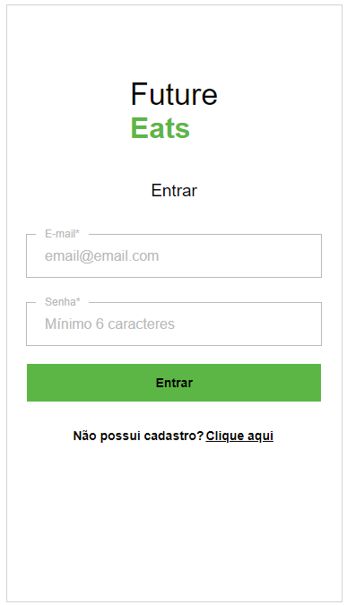
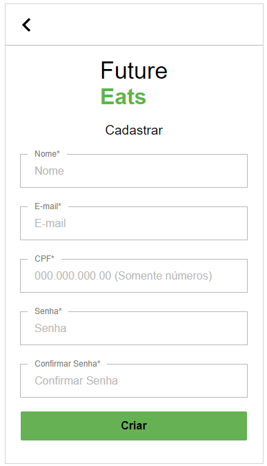
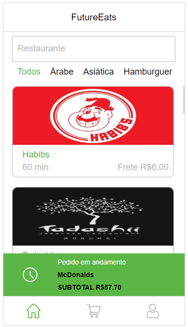
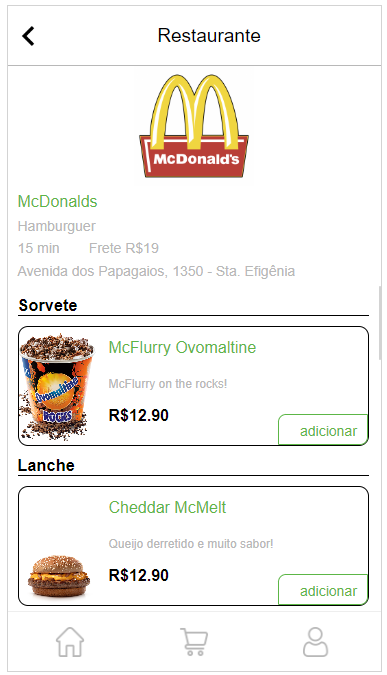
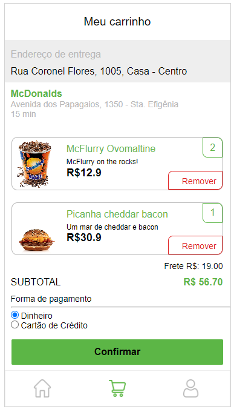
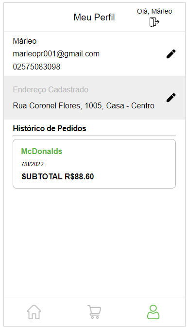
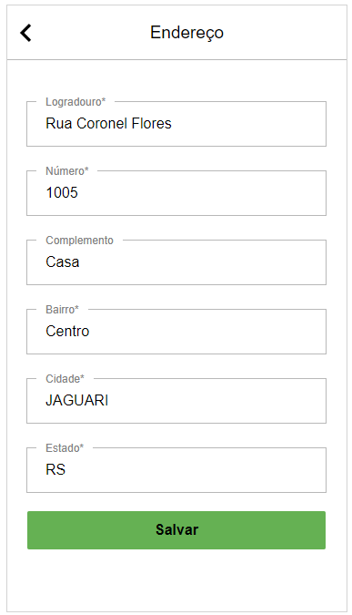

# `Projeto`
Projeto LabeFoods

# `Link`
https://labefoods-alves5.surge.sh

# `Descrição`
O Projeto LabeFoods foi desenvolvido como projeto final de Front End dentro do curso Full-Stack Web Developer da Labenu, o qual consiste em requisições (via axios) para a API labeFoods, que contém informações relacionadas ao desenvolvimento de uma aplicação que simula um aplicativo semelhante ao conhecido app iFood. Este projeto foi baseado no layout layout FutureEats.
 
A documentação da API pode ser encontrada [aqui](https://documenter.getpostman.com/view/7549981/SWTEdGtT)
 
O repositório do projeto pode ser encontrado [aqui](https://github.com/future4code/Alves-labe-food5)

# `Modo de usar`
Ao iniciar a aplicação o usuário é direcionado para a tela de Login. Nesta tela, o usuário pode efetuar seu login ou então se inscrever na plataforma, criando um usuário com nome, email, senha e dados de endereço.
 
Após efetuar login, o usuário é redirecionado para a página de feed, onde poderá escolher entre diferentes tipos de restaurantes, podendo filtrar por palavras chave (utilizando para o tal o campo de buscas) ou por tipos de comidas, na barra superior. Dentre as opções estão por exemplo comida Asiática, Hamburgueres, Italiana, Sorvetes entre outros.
 
Clicando sobre a imagem de um restaurante no feed, o usuário é redicionado para a página de detalhes detes, onde são listados todos os alimentos fornecidos pelo estabelecimento, podendo o usuário adicionar e remover produtos para o seu carrinho.
 
Na parte inferior existe um menu, onde o usuário pode acessar a página de carrinho e verificar todos os itens que adicionou ao mesmo, valor do frente e total da compra, além de selecionar um método de pagamento. Também é possível remover itens da lista. Ao clicar em confirmar, será exibida uma mensagem de pedido realizado com sucesso.
 
No menu inferior, o usuário pode clicar no ícone de perfil e então será redirecionado para a página de perfil do usuário, onde pode alterar seus dados cadastrais e de endereço, e ainda verificar o seu histórico de pedidos. No canto superior direito da página, é possível também fazer o logout da conta, sendo então redirecionado para a página de login.

# `Instalando e rodando o projeto`
Fazer o clone do projeto:
- git clone link-do-repositório

Instalar as dependências:
- npm install

Rodar o projeto:
- npm run start

# `Tecnologias utilizadas`

# `Autores`

Evandro Paulo Folletto
 
  
 

José Robinaldo Ramos da Silva
 
 
 

Leonardo José Silva Lopes de Souza
 
 
 

Márleo Piber da Rosa
 
 
 

Olavo Marques do Nascimento
 
 

# `Imagens`
### Página Login

### Página SignUp (Cadastro)

### Página Feed

### Página detalhes

### Página Carrinho

### Página Perfil

### Página Editar perfil

### Página Editar Endereço
